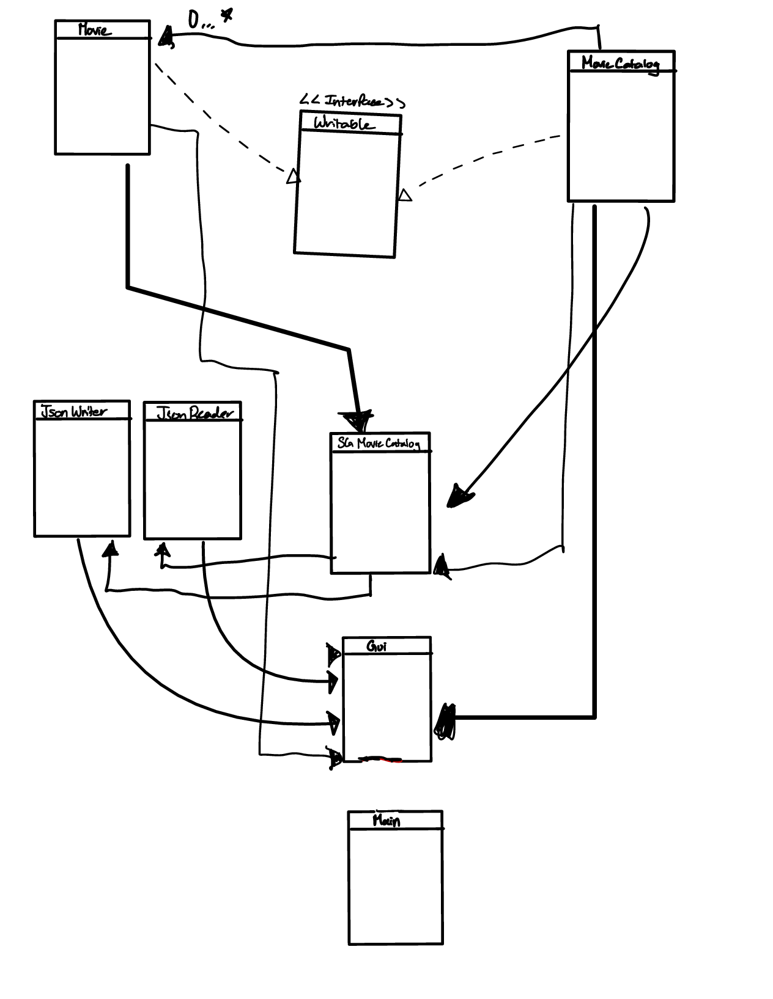

# My Personal Project

# *Phase 0:*
## Task 2 

**Questions:**
- **What will the application do?** 
- **Who will use it?**
- **Why is this project of interest to you?**

So my project is Movie Catalog, similar to IMBD or RottenTomato that is shows a movie, and the specifics of it such as the cast, movie summary, 
and ratings. Of course there's so many movies across the whole wide world, so my catalog will 
speifically show Indian movies. The reason is I chose Indian movies because I am a huge fan of indian cinema
it really combines everything with different genres and have musical aspects. But not only that India has 780 
languages at the country so there's many different indian films in different languages. Which can be fun
with my project cause I can make a filter system to make incoprate what language they want to learn about. Of course
this project will be used with everyone who curious, or fans of Indian cinema. 

## Task 3 

**User Stories**
- As a user, I want to be able to add a review to a movie, like a comment section, 
- As a user, I want to search up certain movie by search the movie name 
- As a user, I want to view the casts of a movies other works, they did throughout their careers when you're on 
a certain movie (basically you click on an person on a movie page and sends you to their works)
- As a user, I want to be able to filter the catalog, by the languages (either Tamil, Hindi, Telugu, Malaynam, 
  and Kannada), and rating out of 5 to find certain films
- As a user, I want to be able to add and remove movies from catalog 

## Phase 2 

**User Stories**
- As a user, I want to save your movie list you already are making 
- As a user, I want to give the option if they want load the movie list from a prievous attmept

# Instructions for Grader

- You can generate the first required action related to the user story "adding multiple Xs to a Y" by
  My first task is to add movies in a add movie button where you can put Title, Year, Director, Rating, 
language, Actors, Review, MovieId when its added it should go to the other DisplayMovie panel to view the list of
movies in your catalog. 
- The second task is to remove movies from the DisplayMovies (or the view movie panel), the way it should happen is to 
  you click remove button and you use the movieID and type it should remove the movie from the list 
- You can locate my visual component by using a button by that states view my movie list and it would only show 
the movie title and movie ID
- You can save the state of my application by clicking a button to save the button, if there's no movies to save 
  it should state that "No movies to save"
- You can reload the state of my application by having a load movie button that states "load has been successful", if
  there is nothing to load then it will say "Unable to load movies from "

# Phase 4 Task 2 

- An event is logged  once you add a movie into the movie catalog, the eventlog will record
  'Movie added to catalog: Name of the Movie' into the console 
- An event is logged once you remove a movie into the movie catalog, the eventlog will record 
  ' Movie removed from Catalog: R123 '
- An event is logged once you save your movie catalog it will record it as 'Movies were saved in the Catalog'
- An event is logged once you load 

# Phase 4 Task 3

If I had more time to refactor my code, I would first add filter function in my gui, as I had in my text 
console there was function filtering your movie catalog but genre, langugage, and Movie Title. The way I would
do that is by add sepearte panel with different buttons on asking which filter you want to do. Also maybe I should have 
found a way to have connect and used SGMovieCatalog in GUI as It would help me make my buttons code much easier. 